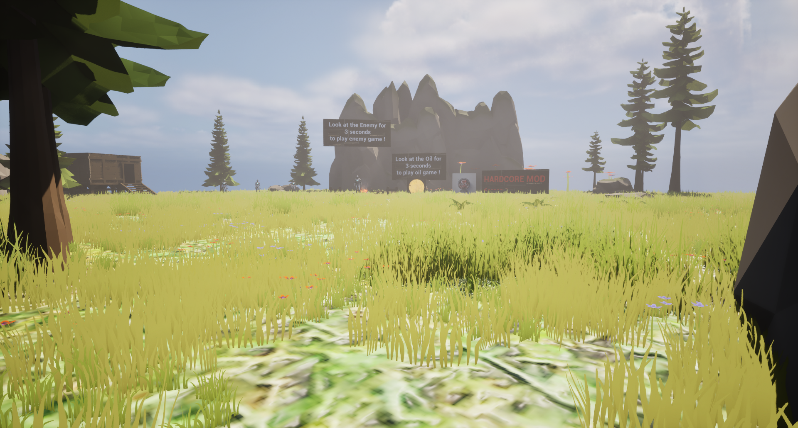
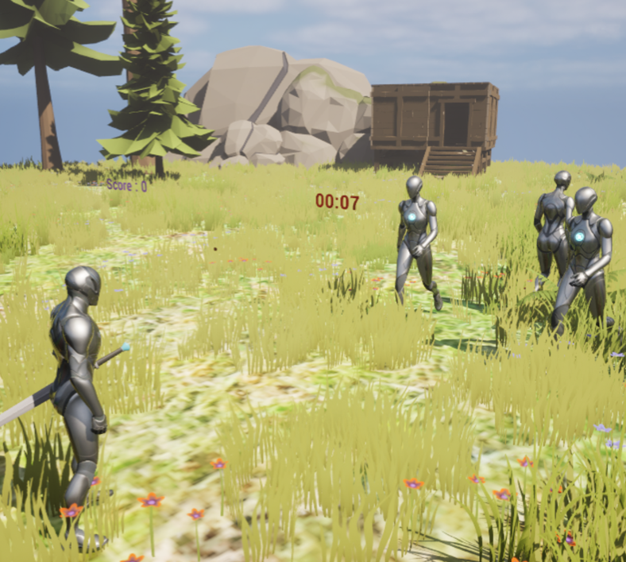
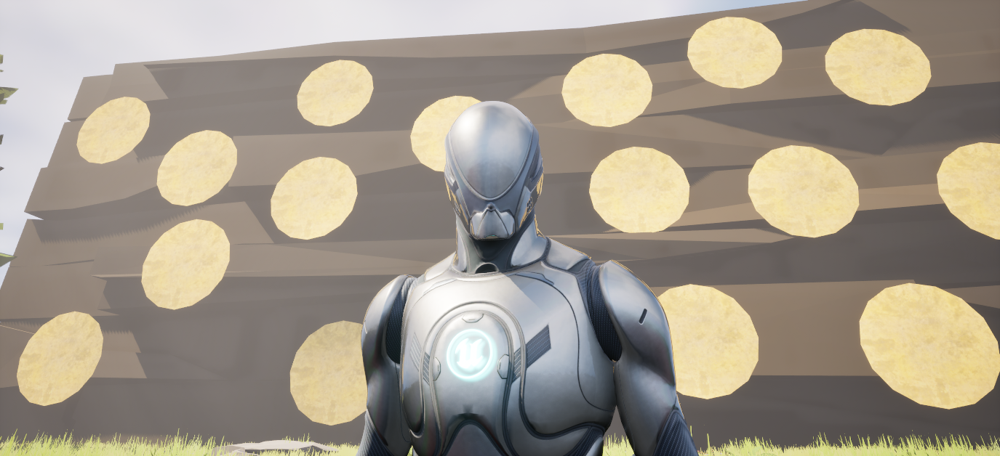

# Watch & Win - Mobile Project II - 2024-2025

> **El Bouchtili Imaddine | March 01st, 2025**

--------------------------

## Introduction
Watch & Win is a game developed with the Unreal Engine 5.4 engine for Android phones. The game consists of two mini games that are played in virtual reality and primarily use gaze mechanics for interactions with elements in the world. This game was carried out as part of the Mobile II programming course. This course is part of the third-year Bachelor's degree in Computer Science : Application Development at the Haute École Libre de Bruxelles.

## Unreal Engine
For this project, I used Unreal Engine 5.4, the game engine developed by Epic Games. Unreal Engine is a powerful and comprehensive engine that offers a wide range of built-in features, such as real-time rendering, advanced lighting management, visual effects, and virtual reality support. This allowed me to focus on gameplay and design without having to code a game engine from scratch.

Unreal Engine offers the possibility of using Blueprints, a visual scripting system. In my project, I used a combination of C++ and Blueprints. C++ was used for game logic-related functionalities, while Blueprints allowed me to fine-tune and simplify the development of movement algorithms.

## Features
Watch & Win is designed for players who want to test or train their precision and reflexes through two mini-games.

Two additional features enhance the user experience, including a system that increases the difficulty of the mini-games and a movement system.

### Enemy-Game
At the start of this mini-game, three enemies approach the player. When the player looks at them, the enemies move backward. The goal is to keep the enemies at a distance for as long as possible before getting hit.

### Oil-Game
When this mini-game starts, a large board appears with oil stains on it. When the player looks at the oil stains, they gradually disappear. Once all the stains have completely vanished, the player wins the game.

### Hardcore mode
To make the two mini-games more challenging, I added a feature that removes the crosshair. This way, players don't actually know where they are looking.

### Movement
To allow players to recharge on a nature-rich map, I added the ability to move within the game. The movement is controlled using an external keyboard connected to the phone.
